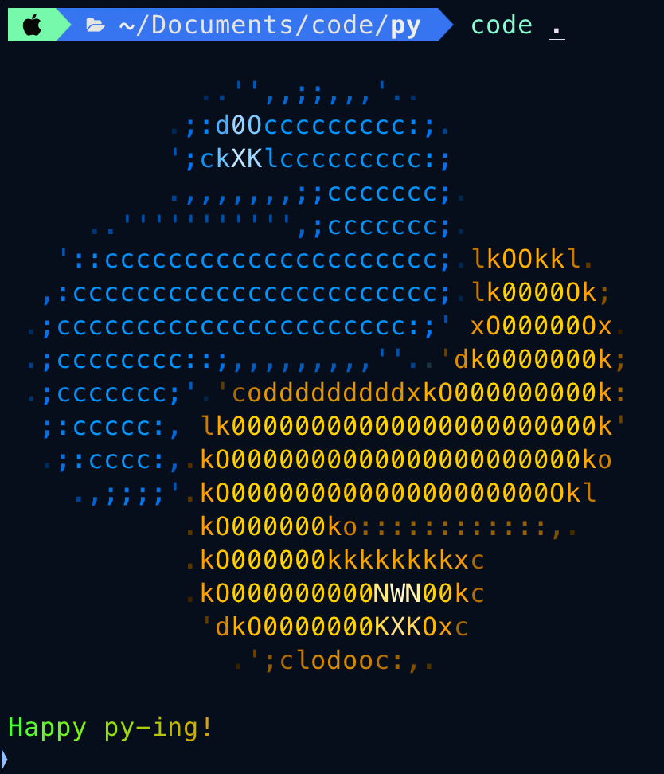
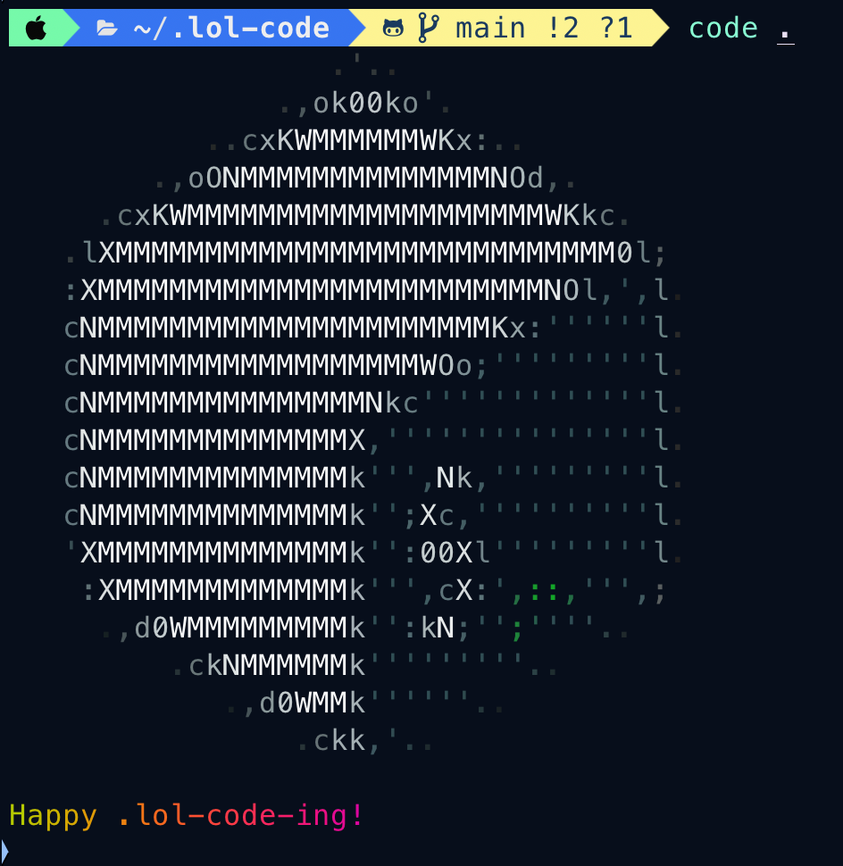
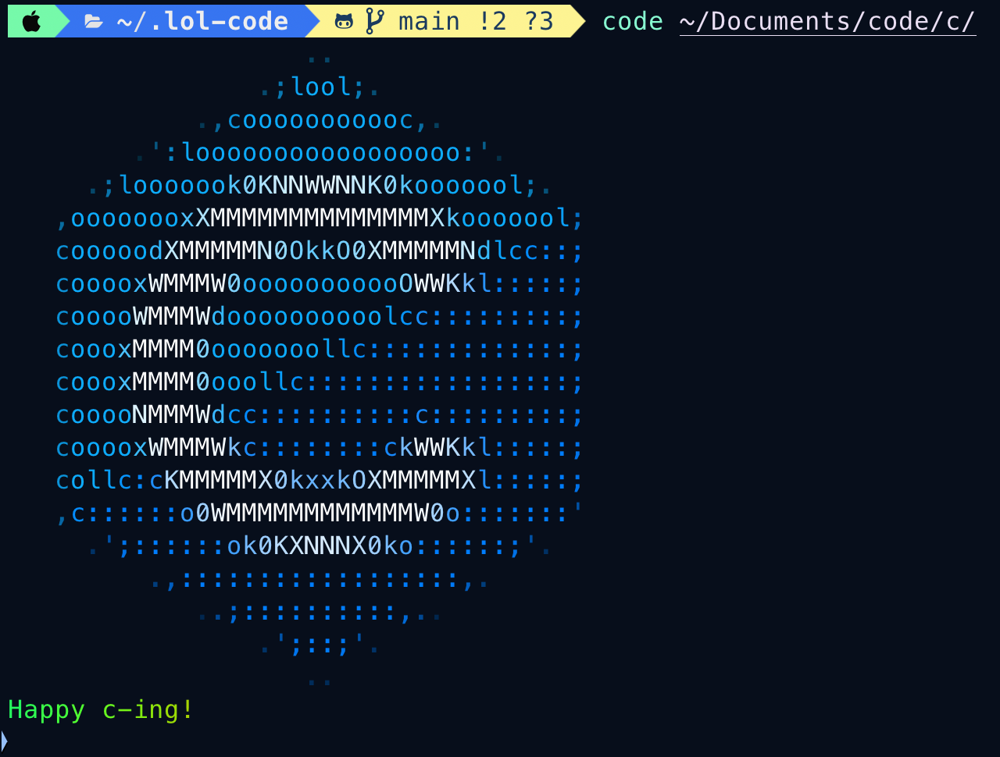
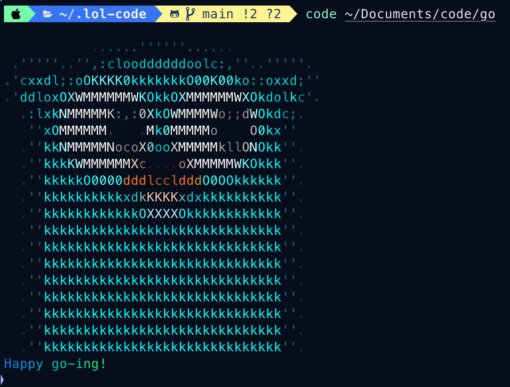

<p align="center"><a href="https://laravel.com" target="_blank"></a></p>

<p align="center">
<!-- shields -->


</p>

## Description

A ricing tool for Visual Studio Code in your terminal. It displays with ASCII art the predominant language of the files in the current directory / the extension of the file you are currently editing.

To use it, simply type `code` in your terminal.

_et voilà_ ! Give it a star if you like it 🌟

## Pre-requisites

- alias `code` to open Visual Studio Code (or code binary in your PATH)
- go
- jp2a, imagemagick, jq

## Installation

```bash
git clone git@github.com:LOISGALLAUD/rice-code.git ~/.rice-code
cd ~/.rice-code
go build ~/.rice-code/get_language.go
cd - > /dev/null
echo "alias code='~/.rice-code/rice-code.sh'" >> ~/.zshrc # or ~/.bashrc
```

## Examples





